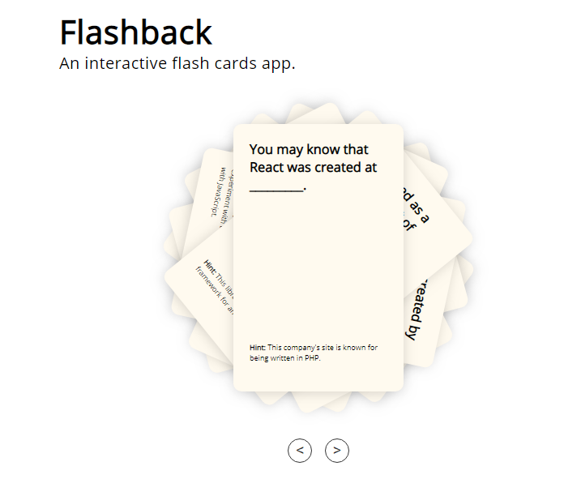

This is a cool Flashback app built to educate users on the origin of REACT. The questions are on the front while the answers on the back of the cards. Users can skip questions or simply click on the card to reveal the answer. Languages used includes: CSS, HTML, JavaScript, and PHP.

https://flashback-vincent-job.herokuapp.com/index.html
